# Zenpi Stage 2 Android ↔ Unix — Gantt

```yaml
schema_version: execution-gantt/stage2
source_path: Docs/stage2_android2unix_blueprint.md
spec_path: Docs/stage2_android2unix_spec.md
projection_authority: false
generated_at: '2026-09-20T02:03:21+08:00'
source_sha256: bdfc159aa77b37420c81e9843678042b82192f9a0c78b5001ee7a907a83e9a7d
spec_sha256: 6eaef18f8613ce978159df741f689d3898723dfdb2edd5649dec27925aecbde9
unclaimed: 35
self_tested: 0
master_accepted: 0
unscheduled_policy: visible without invented calendar dates
```

> 只读投影；唯一权威来源是 `Docs/stage2_android2unix_blueprint.md`。横轴表示依赖深度，不表示日历工期。

## Progress

| State | Count |
|---|---:|
| master accepted | 0 |
| worker self-tested | 0 |
| unfinished | 35 |

## Dependency Gantt

```mermaid
gantt
    title Stage 2 dependency projection (not calendar duration)
    dateFormat X
    axisFormat %s
    section L0
    S2-001 Freeze Stage 2 authority, baseline digest, selector and :S2-001, 1, 1s
    S2-002 Build portable Stage 2 Blueprint validator and same-nam :S2-002, 2, 1s
    S2-003 Freeze host/API schema version and compatibility policy :S2-003, 2, 1s
    section L1
    S2-010 Introduce transport-independent bounded frame I/O :S2-010, 3, 1s
    S2-011 Implement opt-in TLS/TCP listener lifecycle for `zenpi  :S2-011, 4, 1s
    S2-012 Add QR invite, host identity and pinned-key pairing :S2-012, 5, 1s
    S2-013 Add device registry, project ACL and revocation :S2-013, 6, 1s
    S2-014 Adapt owned headless streams to the network host :S2-014, 7, 1s
    S2-015 Define host-owned workspace control API :S2-015, 8, 1s
    S2-016 Move layer-2 tabs into a host-owned stable-ID domain :S2-016, 9, 1s
    S2-017 Expose safe in-place/worktree add/select/move/rename/cl :S2-017, 10, 1s
    S2-018 Connect per-worktree concurrency to the scheduler :S2-018, 10, 1s
    S2-019 Unify TUI, headless and Android command routing :S2-019, 11, 1s
    S2-020 Add event projection, redaction, backpressure and bound :S2-020, 12, 1s
    section L2
    S2-030 Scaffold Android Kotlin/Compose app and shared schema m :S2-030, 3, 1s
    S2-031 Implement QR scanner, invite parser and pairing confirm :S2-031, 6, 1s
    S2-032 Implement Android TLS client and bounded frame transpor :S2-032, 7, 1s
    S2-033 Build Android event reducer, cursor cache and snapshot  :S2-033, 13, 1s
    S2-034 Implement workspace primary tabs and host-backed CRUD :S2-034, 14, 1s
    S2-035 Implement worktree secondary tabs and per-tab concurren :S2-035, 15, 1s
    S2-036 Implement transcript, stream event, approval, diff and  :S2-036, 14, 1s
    S2-037 Implement Android Keystore storage and device revoke UX :S2-037, 7, 1s
    S2-038 Implement foreground/offline/resume lifecycle and Netwo :S2-038, 14, 1s
    section L3
    S2-050 Add Rust protocol/property/fuzz boundary tests :S2-050, 13, 1s
    S2-051 Add Unix host end-to-end loopback/LAN integration suite :S2-051, 13, 1s
    S2-052 Add pairing and security adversarial tests :S2-052, 13, 1s
    S2-053 Add network fault and replay-gap acceptance matrix :S2-053, 15, 1s
    S2-054 Verify TUI/headless/Android parity and owner races :S2-054, 16, 1s
    S2-055 Validate Android API 31/34/35 lifecycle behavior :S2-055, 16, 1s
    S2-056 Add migration, backup, uninstall and credential-wipe te :S2-056, 15, 1s
    section L5
    S2-070 Produce reproducible Unix host release and operator run :S2-070, 17, 1s
    S2-071 Produce signed Android debug/release packaging and inst :S2-071, 17, 1s
    S2-072 Run security/privacy and threat-model review :S2-072, 18, 1s
    S2-073 Publish parity, support and known-limits documentation :S2-073, 19, 1s
    section L6
    S2-099 Master integration, full gates, completion surfaces and :S2-099, 20, 1s
```



## Monitoring index

| ID | State | Depends on | Claim/owner | Startup/live | Handoff/integration/repair | Scheduling note |
|---|---|---|---|---|---|---|
| S2-001 | unclaimed | — | unclaimed | not_started | none | unscheduled; estimate is not a calendar date |
| S2-002 | unclaimed | S2-001 | unclaimed | not_started | none | unscheduled; estimate is not a calendar date |
| S2-003 | unclaimed | S2-001 | unclaimed | not_started | none | unscheduled; estimate is not a calendar date |
| S2-010 | unclaimed | S2-003 | unclaimed | not_started | none | unscheduled; estimate is not a calendar date |
| S2-011 | unclaimed | S2-010 | unclaimed | not_started | none | unscheduled; estimate is not a calendar date |
| S2-012 | unclaimed | S2-011 | unclaimed | not_started | none | unscheduled; estimate is not a calendar date |
| S2-013 | unclaimed | S2-012 | unclaimed | not_started | none | unscheduled; estimate is not a calendar date |
| S2-014 | unclaimed | S2-003,S2-010,S2-013 | unclaimed | not_started | none | unscheduled; estimate is not a calendar date |
| S2-015 | unclaimed | S2-003,S2-014 | unclaimed | not_started | none | unscheduled; estimate is not a calendar date |
| S2-016 | unclaimed | S2-015 | unclaimed | not_started | none | unscheduled; estimate is not a calendar date |
| S2-017 | unclaimed | S2-016 | unclaimed | not_started | none | unscheduled; estimate is not a calendar date |
| S2-018 | unclaimed | S2-016 | unclaimed | not_started | none | unscheduled; estimate is not a calendar date |
| S2-019 | unclaimed | S2-014,S2-015,S2-017,S2-018 | unclaimed | not_started | none | unscheduled; estimate is not a calendar date |
| S2-020 | unclaimed | S2-014,S2-019 | unclaimed | not_started | none | unscheduled; estimate is not a calendar date |
| S2-030 | unclaimed | S2-003 | unclaimed | not_started | none | unscheduled; estimate is not a calendar date |
| S2-031 | unclaimed | S2-012,S2-030 | unclaimed | not_started | none | unscheduled; estimate is not a calendar date |
| S2-032 | unclaimed | S2-010,S2-012,S2-030,S2-031 | unclaimed | not_started | none | unscheduled; estimate is not a calendar date |
| S2-033 | unclaimed | S2-020,S2-032 | unclaimed | not_started | none | unscheduled; estimate is not a calendar date |
| S2-034 | unclaimed | S2-015,S2-033 | unclaimed | not_started | none | unscheduled; estimate is not a calendar date |
| S2-035 | unclaimed | S2-017,S2-018,S2-034 | unclaimed | not_started | none | unscheduled; estimate is not a calendar date |
| S2-036 | unclaimed | S2-019,S2-020,S2-033 | unclaimed | not_started | none | unscheduled; estimate is not a calendar date |
| S2-037 | unclaimed | S2-013,S2-030 | unclaimed | not_started | none | unscheduled; estimate is not a calendar date |
| S2-038 | unclaimed | S2-032,S2-033 | unclaimed | not_started | none | unscheduled; estimate is not a calendar date |
| S2-050 | unclaimed | S2-003,S2-010,S2-020 | unclaimed | not_started | none | unscheduled; estimate is not a calendar date |
| S2-051 | unclaimed | S2-011,S2-014,S2-019,S2-020 | unclaimed | not_started | none | unscheduled; estimate is not a calendar date |
| S2-052 | unclaimed | S2-012,S2-013,S2-020 | unclaimed | not_started | none | unscheduled; estimate is not a calendar date |
| S2-053 | unclaimed | S2-020,S2-038,S2-051 | unclaimed | not_started | none | unscheduled; estimate is not a calendar date |
| S2-054 | unclaimed | S2-019,S2-034,S2-035,S2-036,S2-051 | unclaimed | not_started | none | unscheduled; estimate is not a calendar date |
| S2-055 | unclaimed | S2-037,S2-038,S2-053 | unclaimed | not_started | none | unscheduled; estimate is not a calendar date |
| S2-056 | unclaimed | S2-016,S2-037,S2-038 | unclaimed | not_started | none | unscheduled; estimate is not a calendar date |
| S2-070 | unclaimed | S2-051,S2-052,S2-054,S2-056 | unclaimed | not_started | none | unscheduled; estimate is not a calendar date |
| S2-071 | unclaimed | S2-030,S2-037,S2-038,S2-055 | unclaimed | not_started | none | unscheduled; estimate is not a calendar date |
| S2-072 | unclaimed | S2-052,S2-054,S2-055,S2-070,S2-071 | unclaimed | not_started | none | unscheduled; estimate is not a calendar date |
| S2-073 | unclaimed | S2-054,S2-055,S2-070,S2-071,S2-072 | unclaimed | not_started | none | unscheduled; estimate is not a calendar date |
| S2-099 | unclaimed | S2-070,S2-071,S2-072,S2-073 | unclaimed | not_started | none | unscheduled; estimate is not a calendar date |
